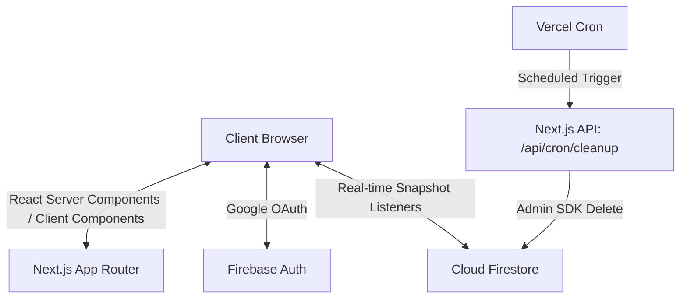

# Architecture (ARCHITECTURE.md)

## System Overview

FFCS MATE follows a modern, serverless architecture utilizing **Next.js (App Router)** for the frontend and API routes, paired with **Firebase** for backend services (Authentication, Real-time Database).

## Diagram

## Component Breakdown

### 1. Frontend Layer (Next.js & React)

- **Framework:** Next.js 14 utilizing the App Router (`/app` directory).
- **Styling:** Tailwind CSS integrated with `next-themes` for dynamic light/dark mode. Glassmorphism utilities are heavily used.
- **State Management:**
  - `Zustand` is used for global client-side state (e.g., currently selected courses, user preferences).
  - `useState`/`useEffect` are used for localized component states.
- **Animations:** Framer Motion (`<MotionDiv>`) is used for page transitions and micro-interactions.

### 2. Authentication Layer (Firebase Auth)

- Handled entirely on the client-side using `signInWithPopup`.
- Google Auth Provider is configured with a strict `hostedDomain` restriction requiring `@vitapstudent.ac.in`.

### 3. Data Layer (Cloud Firestore)

- **Real-time Sync:** The app uses `onSnapshot` listeners to subscribe to Firestore documents. This allows the "Multiplayer Collaboration" feature to instantly reflect changes when a friend adds or drops a course.
- **Data Model:**
  - `rooms/{roomId}`: Contains metadata about the collaboration room (creator, members).
  - `rooms/{roomId}/members/{uid}`: Subcollection containing the specific course selections for each member.

### 4. Background Jobs (Vercel Cron)

- **Endpoint:** `/api/cron/cleanup`
- **Trigger:** Configured in `vercel.json` to run daily.
- **Logic:** Uses the `firebase-admin` SDK to bypass security rules and sweep the database. It deletes rooms that are empty (ghost rooms) or haven't been updated in 48 hours to conserve database quota. Secured via an authorization header checking `process.env.CRON_SECRET`.
