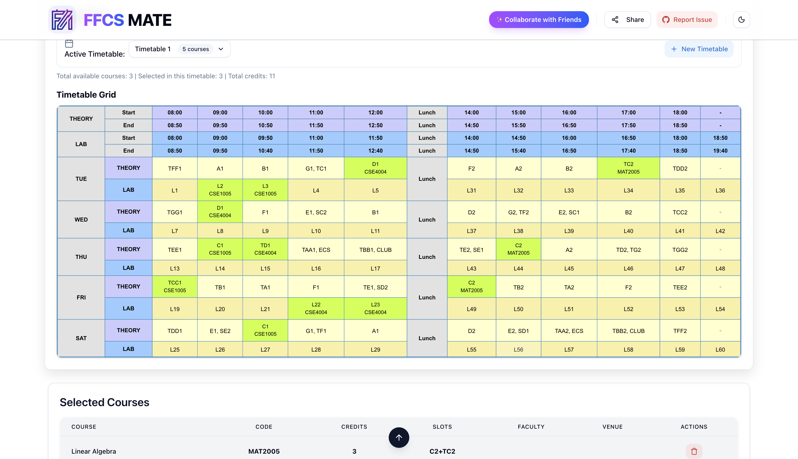

# FFCS MATE 🎓✨

> The ultimate, real-time timetable planner for VIT-AP students.

FFCS MATE is a beautifully designed, intelligent web application built to help VIT-AP students plan their semester courses before the actual FFCS registration portal opens. It eliminates the stress of registration by offering a visual timetable builder, instant clash detection, and multiplayer collaboration.

## Why FFCS MATE?

Registering for courses on the actual day can be incredibly stressful and chaotic. If you wing it without a plan, you risk ending up with clashing slots, terrible gaps between your classes, and daily 8 AM classes. 

FFCS MATE solves all of this by providing:

- **Smart Clash Detection:** Instantly alerts you if two of your selected subjects have overlapping slots.
- **VTOP-Style Grid:** Your schedule is rendered in the exact same format as the real VTOP portal, so you know exactly what to expect on registration day.
- **"No 8 AM" Rule:** Hate waking up early? Flip a toggle to instantly strike out and block all 8 AM classes from your timetable.
- **Real-Time Multiplayer:** Create a "Room", invite your friends, and build your timetables together on the same screen so you can get the exact same classes.
- **Export & Save:** Once your timetable is perfect, download it as a high-quality image so you are ready to just click and register on the real day.

## Quickstart

Want to jump right in and plan your semester?
👉 **[Visit FFCS MATE (Live)](https://ffcsmate.vercel.app)**

Are you a developer looking to contribute or run this locally?
👉 Please see our **[SETUP.md](SETUP.md)** for detailed installation instructions.

## Documentation

To understand how this project is built and maintained, please refer to the following documents:
- **[SPEC.md](SPEC.md)**: Functional and non-functional requirements.
- **[ARCHITECTURE.md](ARCHITECTURE.md)**: How the Next.js App Router connects with Firebase.
- **[DATA_SOURCES.md](DATA_SOURCES.md)**: Where our course data comes from.
- **[SAFETY.md](SAFETY.md)**: Security rules, authentication, and database protection.
- **[CHANGELOG.md](CHANGELOG.md)**: Version history.

## Built With 🛠️
- [Next.js 14](https://nextjs.org/) (App Router, React Server Components)
- [Firebase](https://firebase.google.com/) (Firestore, Auth, Admin SDK)
- [Tailwind CSS](https://tailwindcss.com/) & [Framer Motion](https://www.framer.com/motion/)
- [Radix UI](https://www.radix-ui.com/)
- [Zustand](https://github.com/pmndrs/zustand) (State Management)

---
Made with ❤️ for VITAPians by [Sabarishwaran V](https://github.com/sabarishwaran-v).
